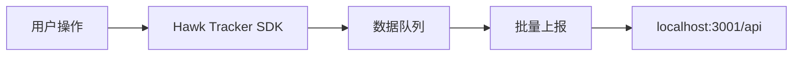
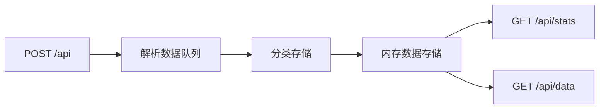
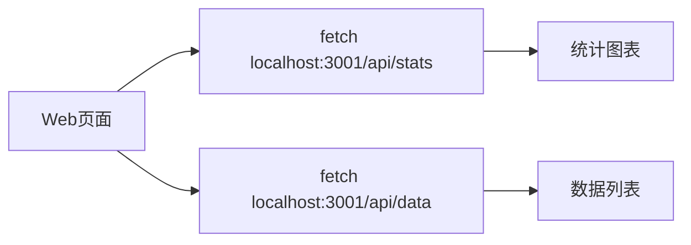

# Hawk Tracker 监控系统文档

## 📋 目录
- [系统概述](#系统概述)
- [文件修改前后对比](#文件修改前后对比)
- [启动方式](#启动方式)
- [数据流程](#数据流程)
- [系统状态](#系统状态)
- [联调指南](#联调指南)
- [API接口文档](#api接口文档)
- [故障排除](#故障排除)

## 🎯 系统概述

Hawk Tracker 是一个完整的 Web 应用监控系统，包含：
- **Server端**: Koa.js 数据接收和处理服务
- **Web端**: React 监控数据展示平台
- **SDK**: 前端监控数据收集和上报

### 技术栈
- **Server**: Koa.js, TypeScript, pnpm
- **Web**: React, React Router v7, TypeScript, Tailwind CSS v3
- **SDK**: Hawk Tracker Core + Plugins (Error, Performance, Behavior)
- **构建工具**: Vite, Rollup, pnpm workspace

## 📝 文件修改前后对比

### 🔧 Server端修改

#### 修改前状态
- 使用 `koa-logger` 中间件（存在类型问题）
- 没有数据存储机制
- 没有通用数据接收端点
- 使用 `koa-router` 而不是 `@koa/router`

#### 修改后状态

**apps/server/src/index.ts**
```typescript
// 主要变更：
- 移除了有问题的 koa-logger
- 添加了自定义请求日志中间件
- 添加了 CORS 配置 (origin: '*')
- 添加了错误处理中间件
- 端口改为 3001
- 添加了内存数据存储 (dataStore)
```

**apps/server/src/router.ts**
```typescript
// 主要变更：
- 添加了通用数据接收端点 POST /api
- 实现了数据分类存储（errors, performance, behaviors, events）
- 添加了数据查询接口 GET /api/data
- 添加了统计接口 GET /api/stats
- 添加了数据清理接口 DELETE /api/data
- 改为使用 require('@koa/router') 解决模块导入问题
```

**apps/server/package.json**
```json
// 主要变更：
- 添加了 @koa/cors, @koa/router 依赖
- 添加了 tsx, typescript 开发依赖
- 更新了构建脚本使用 tsc
- 移除了有问题的 koa-logger 相关依赖
```

### 🌐 Web端修改

#### 修改前状态
- 使用 MockAPI 模拟数据
- 没有真实的监控SDK集成
- Tailwind CSS v4 配置有问题
- 缺少监控初始化

#### 修改后状态

**apps/web/app/monitor.ts (新增)**
```typescript
// 完整功能：
- Hawk Tracker SDK 完整配置
- DSN 指向 localhost:3001/api
- 启用了 ErrorPlugin, PerformancePlugin, BehaviorPlugin
- 配置了数据批量上报和重试机制
- 配置了错误过滤和请求过滤
- 提供了监控实例管理函数
```

**apps/web/app/root.tsx**
```typescript
// 主要变更：
- 添加了 useEffect 调用 initMonitor()
- 确保应用启动时初始化监控SDK
```

**apps/web/app/components/projects/[projectId]/log/overview/page.tsx**
```typescript
// 主要变更：
- 改为从 localhost:3001/api/stats 获取真实统计数据
- 改为从 localhost:3001/api/data 获取最近数据
- 添加了30秒自动刷新机制
- 移除了 MockAPI 依赖
```

**apps/web/app/app.css**
```css
// 主要变更：
- 从 Tailwind CSS v4 迁移到 v3
- 更新了 @tailwind 指令语法
- 移除了 v4 特定的 @custom-variant 和 @theme 指令
- 替换了自定义CSS变量为标准Tailwind类
```

**apps/web/postcss.config.mjs**
```javascript
// 主要变更：
- 改为直接定义 tailwindcss 和 autoprefixer 插件
- 移除了对 @workspace/ui 的依赖
```

## 🚀 启动方式

### 1. 启动Server
```bash
# 进入Server目录
cd apps/server

# 构建TypeScript代码
pnpm build

# 启动服务器
node dist/index.js
```

**Server运行地址**: `http://localhost:3001`

### 2. 启动Web
```bash
# 进入Web目录
cd apps/web

# 开发模式启动
pnpm dev
```

**Web运行地址**: `http://localhost:3000`

### 3. 同时启动两个服务
```bash
# 终端1 - 启动Server
cd apps/server && pnpm build && node dist/index.js

# 终端2 - 启动Web
cd apps/web && pnpm dev
```

## 📊 数据流程

### 1. 监控数据收集流程


**详细步骤**:
1. 用户在Web应用中执行操作
2. Hawk Tracker SDK 自动收集相关数据
3. 数据进入内部队列
4. 达到批量大小或时间间隔时自动上报
5. 数据发送到 Server 的 `/api` 端点

### 2. Server数据处理流程


**详细步骤**:
1. Server 接收 POST 请求到 `/api` 端点
2. 解析请求体中的 `dataQueue` 数组
3. 根据每个数据项的 `type` 字段分类
4. 存储到对应的内存数组（errors, performance, behaviors, events）
5. 为每个数据项添加唯一ID和时间戳
6. 通过 GET 接口提供数据查询服务

### 3. Web数据展示流程


**详细步骤**:
1. Web页面组件挂载时发起数据请求
2. 从 Server 获取统计数据和最近数据
3. 更新组件状态并重新渲染
4. 每30秒自动刷新数据
5. 在页面上展示监控图表和数据列表

## 📈 系统状态

### ✅ 已完成功能
- ✅ Server数据接收和存储
- ✅ Web监控SDK集成
- ✅ 基础数据展示
- ✅ 实时数据更新
- ✅ 错误、性能、行为数据收集
- ✅ 数据查询和统计接口
- ✅ 自动数据刷新机制

### ⚠️ 需要完善功能
- ⚠️ 性能监控页面（只有占位符）
- ⚠️ 用户行为页面（功能不完整）
- ⚠️ 数据可视化图表
- ⚠️ 数据持久化存储
- ⚠️ 错误详情页面优化
- ⚠️ 数据筛选和搜索功能

### 🔄 当前数据存储
- **存储方式**: 内存存储
- **数据持久性**: 重启后数据丢失
- **数据分类**: errors, performance, behaviors, events
- **数据格式**: JSON格式，包含唯一ID和时间戳

## 🔧 联调指南

### 1. 环境准备
确保以下服务正常运行：
- Node.js 18+
- pnpm 8+
- 端口 3000 和 3001 可用

### 2. 启动步骤
```bash
# 步骤1: 启动Server
cd apps/server
pnpm build
node dist/index.js

# 步骤2: 启动Web (新终端)
cd apps/web
pnpm dev

# 步骤3: 验证服务
# 访问 http://localhost:3000 (Web)
# 访问 http://localhost:3001/api/stats (Server)
```

### 3. 测试数据流
```bash
# 测试1: 触发错误
# 在浏览器控制台执行:
throw new Error('测试错误');

# 测试2: 查看Server日志
# 在Server终端查看是否收到错误数据

# 测试3: 查看Web数据
# 访问项目监控页面，查看错误数据是否显示

# 测试4: 测试性能数据
# 刷新页面，查看是否收集到性能指标

# 测试5: 测试行为数据
# 点击页面元素，查看是否记录用户行为
```

### 4. 验证检查点
- ✅ Server控制台显示启动成功
- ✅ Web页面正常加载
- ✅ 监控概览页面显示数据
- ✅ 浏览器控制台显示SDK初始化成功
- ✅ 触发错误后Server收到数据
- ✅ Web页面自动刷新显示新数据

## 📡 API接口文档

### 数据接收接口

#### POST /api
接收监控数据的主要接口

**请求格式**:
```json
{
  "dataQueue": [
    {
      "type": "error|performance|behavior|event",
      "subType": "具体子类型",
      "data": "具体数据内容"
    }
  ],
  "baseInfo": {
    "userAgent": "浏览器信息",
    "timestamp": "时间戳"
  }
}
```

**响应格式**:
```json
{
  "success": true,
  "message": "Successfully processed X items",
  "processed": 5
}
```

### 数据查询接口

#### GET /api/stats
获取统计数据

**响应格式**:
```json
{
  "success": true,
  "data": {
    "events": 10,
    "errors": 5,
    "performance": 8,
    "behaviors": 15,
    "total": 38
  }
}
```

#### GET /api/data
获取详细数据列表

**查询参数**:
- `type`: 数据类型 (events|errors|performance|behaviors|all)
- `limit`: 每页数量 (默认100)
- `page`: 页码 (默认1)

**响应格式**:
```json
{
  "success": true,
  "data": {
    "list": [...],
    "total": 38,
    "page": 1,
    "limit": 10,
    "totalPages": 4
  }
}
```

#### DELETE /api/data
清空所有数据（开发用）

**响应格式**:
```json
{
  "success": true,
  "message": "数据已清空"
}
```

## 🔍 故障排除

### 常见问题

#### 1. Server启动失败
**错误**: `Cannot find module 'koa-router'`
**解决**: 确保使用 `@koa/router` 而不是 `koa-router`

#### 2. Web启动失败
**错误**: `Cannot find module '@tailwindcss/postcss'`
**解决**: 确保使用 Tailwind CSS v3 配置

#### 3. SDK数据上报失败
**错误**: `POST http://localhost:3001/api 404 (Not Found)`
**解决**: 确保Server已启动并重新构建

#### 4. 数据不显示
**错误**: Web页面显示"加载中..."
**解决**: 检查Server是否正常运行，网络连接是否正常

### 调试技巧

#### Server调试
```bash
# 查看Server日志
cd apps/server
node dist/index.js

# 测试API接口
curl http://localhost:3001/api/stats
```

#### Web调试
```bash
# 查看浏览器控制台
# 检查SDK初始化日志
# 检查网络请求

# 测试数据上报
# 在浏览器控制台执行:
trackEvent('test', { message: '测试事件' });
```

#### SDK调试
```javascript
// 在浏览器控制台查看SDK状态
console.log(window.hawkTracker);

// 手动触发数据上报
window.hawkTracker.flush();
```

## 📚 相关文件

### 核心配置文件
- `apps/server/src/index.ts` - Server主文件
- `apps/server/src/router.ts` - API路由定义
- `apps/web/app/monitor.ts` - 监控SDK配置
- `apps/web/app/root.tsx` - Web应用根组件

### 数据展示页面
- `apps/web/app/components/projects/[projectId]/log/overview/page.tsx` - 监控概览
- `apps/web/app/components/projects/[projectId]/log/errors-log/page.tsx` - 错误日志
- `apps/web/app/components/projects/[projectId]/log/performance/page.tsx` - 性能监控

### 构建配置
- `apps/server/package.json` - Server依赖配置
- `apps/web/package.json` - Web依赖配置
- `apps/web/vite.config.ts` - Vite构建配置
- `apps/web/postcss.config.mjs` - PostCSS配置

---

**文档版本**: 1.0.0  
**最后更新**: 2024年12月  
**维护者**: Hawk Tracker Team 